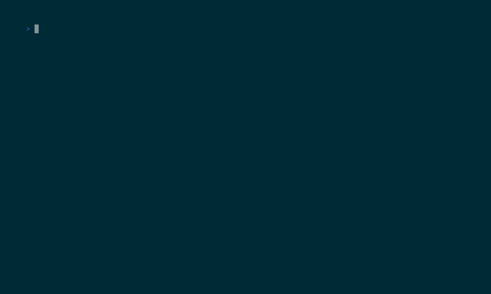

# manyterminals

`manyterminals` is a Codex skill repository for coordinating lots of terminal emulator windows on Linux. It inventories running terminals, tries emulator-specific or OCR-based content capture, can close idle single-tab scratch terminals, keeps tmux assignment intent in Markdown, and can publish the repo with `gh`.

When Wayland blocks reliable window capture, `close-empty` falls back to terminal descendant-process inspection so prompt-only launches can still be closed without touching multi-tab or actively running sessions.

## Status


## Terminal Demo

The repository includes a recorded terminal-UI run generated from a stable fixture and re-rendered in GitHub Actions. The latest published copy is hosted on GitHub Pages:

- https://realagiorganization.github.io/manyterminals/ui-demo.gif



## Local Development

```bash
python3 -m venv .venv-test
. .venv-test/bin/activate
python -m pip install -r requirements-test.txt
pytest -q
bash scripts/run-tests-in-docker.sh
python3 scripts/manyterminals.py record-fixture tests/fixtures/local-snapshot.json
python3 scripts/manyterminals.py inspect --fixtures tests/fixtures/inspection.json
python3 scripts/manyterminals.py close-empty --dry-run --fixtures tests/fixtures/inspection.json
python3 scripts/manyterminals.py ensure-tmux --dry-run --state-file state/tmux-sessions.md
```

`record-fixture` writes the same JSON shape consumed by `inspect --fixtures`, which makes it suitable for capturing new regression cases from a live desktop before checking them into `tests/fixtures/`.

## Runtime Coverage

The current capture and control matrix is:

- `tmux`: session/window capture through `tmux capture-pane`
- `kitty`: tab text through `kitty @ ls` and `kitty @ get-text`
- `wezterm`: pane text through `wezterm cli list` and `wezterm cli get-text`
- X11 windows: `wmctrl` first, then `xdotool`
- Wayland or unsupported emulators: screenshot and OCR when available, otherwise descendant-process fallback for `close-empty`
- KDE-style wrappers such as `qmlkonsole` and `yakuake`: descendant PID search and process-tree fallback

Known remaining limitation: tab enumeration for emulators like `ghostty`, `konsole`, and `qterminal` is still best-effort unless they expose text through tmux, OCR, or a child process tree that can be classified safely.

## Test Coverage

- `tests/test_bdd.py` plus `tests/features/close_empty.feature`: BDD coverage for the Wayland close-empty fallback using the live regression fixture
- `tests/test_manyterminals.py`: unit coverage for selector, process-tree, and close fallback logic
- `tests/test_tmux_integration.py`: tmux session integration coverage
- `docker/test.Dockerfile` plus `scripts/run-tests-in-docker.sh`: fully isolated test runner with its own Python and tmux toolchain

## GitHub Actions

The CI workflow does three things on every push and pull request:

- runs the pytest suite
- builds the isolated test container and runs the suite inside it
- renders the terminal UI demo from `demos/ui-demo.tape` and uploads the GIF as a workflow artifact

A separate Pages workflow publishes `docs/ui-demo.gif` so the demo can be linked without relying only on the checked-in asset.

## Releases

The repository ships under the MIT license and uses lightweight semantic version tags. `v0.1.0` is the first tagged release cut after the green CI/demo pipeline landed.

## Repo Layout

- `SKILL.md`: skill instructions for Codex
- `scripts/manyterminals.py`: main CLI
- `state/tmux-sessions.md`: Markdown plan for tmux sessions
- `tests/`: unit and CLI coverage
- `demos/ui-demo.tape`: recorded terminal UI scenario
- `docs/ui-demo.gif`: checked-in render used by the README
